# Developer Guide

## Acknowledgements

BookKeeper uses the following tools for documentation, development and testing:

1. [JUnit](https://junit.org/junit5/) - Used for software testing.
2. [Gradle](https://gradle.org) - Used for build automation.
3. [PlantUML](https://plantuml.com/) - Used for diagram creation.

## Setting Up the Development Environment

### Prerequisites

- JDK 17
- Gradle 7.6.2 or higher
- IntelliJ IDEA (recommended)

### Getting Started

1. Clone the repository:

   ```
   git clone https://github.com/AY2425S2-CS2113-T12-2/tp.git
   ```

2. Import the project as a Gradle project in IntelliJ IDEA:

   - Open IntelliJ IDEA
   - Select "Import Project"
   - Navigate to the project directory and select the `build.gradle` file
   - Follow the prompts to complete the import

3. Verify the setup:
   - Run the tests: `./gradlew test`
   - Run the application: `./gradlew run`

## Design

### Component Overview

The architecture of BookKeeper follows a layered design, with each component responsible for a specific aspect of the application. Below is an overview of the key components:

#### 1. Main Component (`BookKeeper.java`)

- Serves as the entry point of the application.
- Coordinates interactions between other components.
- Manages the main execution flow.

#### 2. UI Component (`Formatter.java`)

- Handles all user interaction through the command line.
- Displays messages, prompts, and results to the user.
- Formats and prints lists, error messages, and success messages.

#### 3. Logic Component

- **InputHandler (`InputHandler.java`)**: Processes user input and executes the corresponding commands.
- **InputParser (`InputParser.java`)**: Parses user input into command arguments and validates them.
- **Command Classes**: Implement specific functionalities using the Command pattern.

#### 4. Model Component

- **Book and Loan Classes**: Define the core data structures for books and loans.
- **BookList and LoanList**: Manage collections of books and loans, providing methods for adding, removing, and searching.

#### 5. Storage Component (`Storage.java`)

- Handles persistence of data.
- Manages saving and loading of book and loan data.
- Ensures data integrity during file I/O operations.

### Class Structure

The following diagram shows the high-level structure of the application:

```
bookkeeper/
├── BookKeeper.java # Main class
├── logic/
│     ├── InputHandler.java   # Processes user input
│     └── InputParser.java    # Parses and validates input
├── exceptions/
│     ├── BookNotFoundException.java
│     ├── ErrorMessages.java
│     └── IncorrectFormatException.java
├── model/
│     ├── Book.java           # Represents a book
│     └── Loan.java           # Represents a loan
├── list/
│     ├── BookList.java # Manages the collection of books
│     └── LoanList.java # Manages the collection of loans
├── storage/
│     └── Storage.java # Handles data persistence
└── ui/
      └── Formatter.java # Formats and displays output
```

The following is the class diagram of the application:


## Implementation

The following sections provide detailed sequence diagrams for key features of the application, such as adding books, adding loans, and removing books.

### Adding Books

The `add-book` feature allows the user to add a new book to the inventory. Each book includes details of its title, author, category, condition, location, as well as optional notes. The system ensures that a book of the same title does not exist in the inventory and before creating the book.

`InputHandler` coordinates with `InputParser`, `BookList`, `Formatter`, and `Storage` classes to implement the feature.

The following UML sequence diagram shows how the `add-book BOOK_TITLE a/AUTHOR cat/CATEGORY cond/CONDITION loc/LOCATION [note/NOTE]` command is handled.

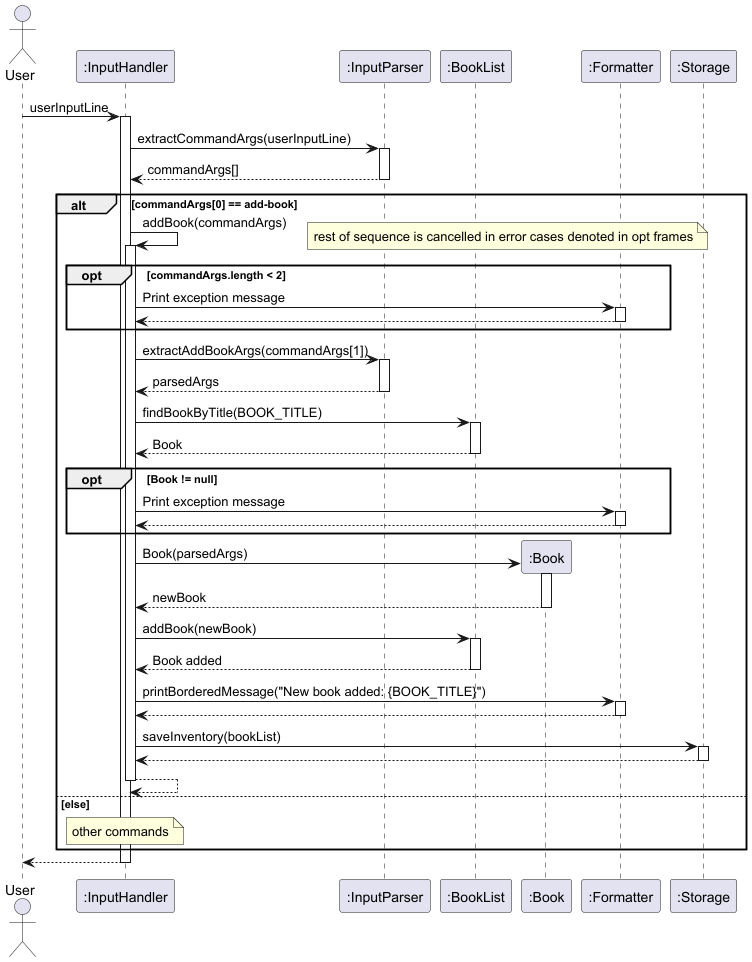

1. User issues command:
   The user inputs the command in the CLI with the required arguments, e.g., `add-book The Great Gatsby a/F. Scott Fitzgerald cat/Fiction cond/Good loc/Shelf B1 note/important`.

2. Command arguments are extracted:
   `InputHandler` first calls `InputParser.extractCommandArgs(...)` to split the user input into command arguments.

   - For example, the input `add-book The Great Gatsby a/F. Scott Fitzgerald cat/Fiction cond/Good loc/Shelf B1 note/important` is split into:
     - `commandArgs[0]`: `"add-book"`
     - `commandArgs[1]`: `"The Great Gatsby a/F. Scott Fitzgerald cat/Fiction cond/Good loc/Shelf B1 note/important"`

3. Book arguments are parsed:
   `InputHandler` invokes `InputParser.extractAddBookArgs(...)` to parse the second part of the command (`commandArgs[1]`) into the following components:

   - Book title
   - Author
   - Category
   - Condition
   - Location
   - Note (Optional)

4. Book is validated:
   BookKeeper does not support multiple books of the same title. `InputHandler` calls `BookList.findBookByTitle(bookTitle)` to check if the book exists in the inventory.

   - If the book is found, `InputHandler` uses `Formatter` to print a "Book already exists in inventory: {Title}" message and exits early.
   - If the book is not found, the flow continues.

5. Book is created:
   If the book does not exist in the inventory:

   - A new `Book` object is created using the parsed arguments. The `note` field is optional and defaults to an empty string if not provided.
   - The `condition` string is converted to a `Condition` enum using `Condition.fromString(...)`.
   - The book is added to the `BookList` using `bookList.addBook(...)`.

6. Changes are saved to persistent storage:
   `InputHandler` calls `Storage.saveLoans(...)` and `Storage.saveInventory(...)` to save the updated book list and inventory.

7. Success message is displayed:
   `InputHandler` uses `Formatter` to print a message indicating that the book was successfully added.

### Adding Loans

The `add-loan` feature allows the user to add a loan for a book in the inventory. The loan includes details such as the borrower's name, return date, phone number, and email. The system ensures that the book exists in the inventory and is not already on loan before creating the loan.

`InputHandler` coordinates with `InputParser`, `BookList`, `LoanList`, `Formatter`, and `Storage` classes to implement the feature.

The following UML sequence diagram shows how the `add-loan BOOK_TITLE n/BORROWER_NAME d/RETURN_DATE p/PHONE_NUMBER e/EMAIL` command is handled.

- The RETURN_DATE must be in the format **DD-MM-YYYY** when provided as input.
- The RETURN_DATE cannot be in the past.
- The PHONE_NUMBER can only be in numeric strings

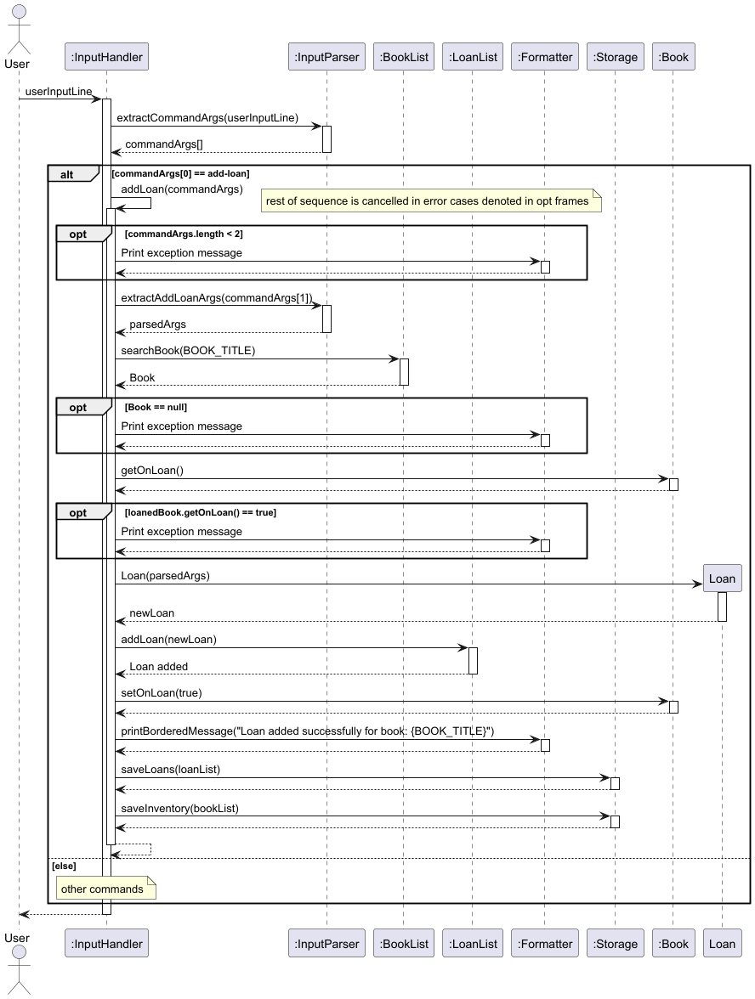

1. User issues command:
   The user inputs the command in the CLI with the required arguments, e.g., `add-loan The Great Gatsby n/John Doe d/28-06-2025 p/98765432 e/john.doe@example.com`.

2. Command arguments are extracted:
   `InputHandler` first calls `InputParser.extractCommandArgs(...)` to split the user input into command arguments.

   - For example, the input `add-loan The Great Gatsby n/John Doe d/28-06-2025 p/98765432 e/john.doe@example.com` is split into:
     - `commandArgs[0]`: `"add-loan"`
     - `commandArgs[1]`: `"The Great Gatsby n/John Doe d/28-06-2025 p/98765432 e/john.doe@example.com"`

3. Loan arguments are parsed:
   `InputHandler` invokes `InputParser.extractAddLoanArgs(...)` to parse the second part of the command (`commandArgs[1]`) into the following components:

   - Book title
   - Borrower's name
   - Return date
   - Phone number
   - Email

4. Book is validated:
   `InputHandler` calls `BookList.findBookByTitle(bookTitle)` to check if the book exists in the inventory.

   - If the book is not found, `InputHandler` uses `Formatter` to print a "Book not found in inventory" message and exits early.
   - If the book is found, the flow continues.

5. Loan status is validated:
   `InputHandler` checks if the book is already on loan using `Book.getOnLoan()`.

   - If the book is already on loan, `InputHandler` uses `Formatter` to print a "The book is currently out on loan" message and exits early.
   - If the book is not on loan, the flow continues.

6. Loan is created:
   If the book exists and is not already on loan:

   - A new `Loan` object is created using the parsed arguments, including the borrower's name, return date, phone number, and email.
   - The loan is added to the `LoanList` using `LoanList.addLoan(...)`. This method automatically updates the book's `onLoan` status to `true`.

7. Changes are saved to persistent storage:
   `InputHandler` calls `Storage.saveLoans(...)` and `Storage.saveInventory(...)` to save the updated loan list and inventory.

8. Success message is displayed:
   `InputHandler` uses `Formatter` to print a message indicating that the loan was successfully added.

### Removing Books

The `remove-book` feature allows the user to remove a book from the inventory using the book title as the identifier.
The system will first check if the book exists, remove all associated loans (if any) before finally removing the book
from the inventory. This prevents orphaned loan records from remaining in the system.

`InputHandler` coordinates with `BookList`, `LoanList` and `Formatter` classes to implement the feature.

The following UML sequence diagram shows how the `remove-book TITLE` command is handled.

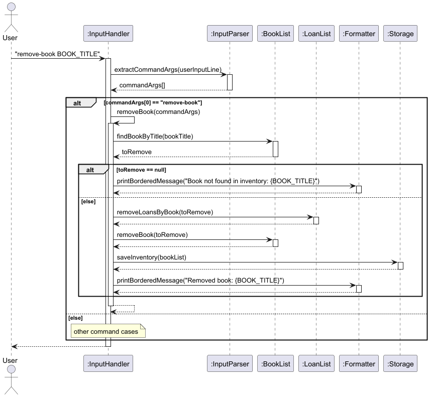

1. User issues command:
   The user inputs the command in the CLI with the book title as an argument, e.g. `remove-book The Hobbit`

2. `InputHandler` first extracts command arguments by invoking `extractCommandArgs(...)`.
   Then, `removeBook(commandArgs)` is invoked to handle the command.

3. `BookList` is queried for the book:
   `InputHandler` calls `BookList.findBookByTitle(bookTitle)` to search for the book.

   - If the book is not found `(toRemove == null)`, `InputHandler` uses `Formatter` to print a "Book not found" message
     and exits early.
   - If the book is found, the flow continues.

4. Associated loans are removed:
   `LoanList.removeLoansByBook(toRemove)` is called to remove all loans associated with the book. This method uses `loanList.removeIf(...)` to filter and remove loans linked to the specified book.

5. Book is removed from the system:
   `InputHandler` calls `BookList.removeBook(toRemove)` to remove the book.

6. Changes are saved to persistent storage:
   `InputHandler` calls `Storage.saveInventory(...)` to save the updated inventory.

7. Success message is displayed:
   `Formatter` is used to print a message indicating successful removal.

### Delete Loans

The `delete-loans` feature allows the user to remove a loan from the list of loans that is being tracked by using the book title and the borrower name as identifiers.
The program will check if first the book exists, then it will use the book object and the borrower name to search if the loan exist before proceeding to remove it.

The following UML sequence diagram shows the behaviour of `delete-loans TITLE`:


1. User issues command:
   The user inputs the command with book title as argument e.g `delete-loan The Hobbit`.

2. `InputHandler` extract command arguments with `extractCommandArgs(...)` followed by deleteLoan(commandArgs).

3. `InputHandler` calls `BookList.findBookByTitle(bookTitle)` to search for the book.
   `InputHandler` calls `LoanList.findLoans(bookTitle)` to search for the loan.

   - If the book is not found `(loanedBook == null)`, not on loan, or there is no existing loan, `InputHandler` uses `Formatter` to print an error message and stops the command early.
   - If the book is found, the flow continues.

4. Delete corresponding loan:
   `InputHandler` calls `LoanList.deleteLoans(loan)` to delete the loan.

5. Sets book to not on loan:
   `InputHandler` calls loanedBook.setOnLoan(false).

6. Success message is displayed:
   `Formatter` is used to print a message indicating successful removal.

### Viewing Books

The `view-inventory` feature allows the user to view all existing books in the inventory. All book information will be printed out in a numbered list. The program will first check if the inventory is empty before proceeding to print out the list.

`InputHandler` coordinates with `InputParser`, `Book`, `BookList` and `Formatter` classes to implement the feature.

The following UML sequence diagram shows how the `view-inventory` command is handled.

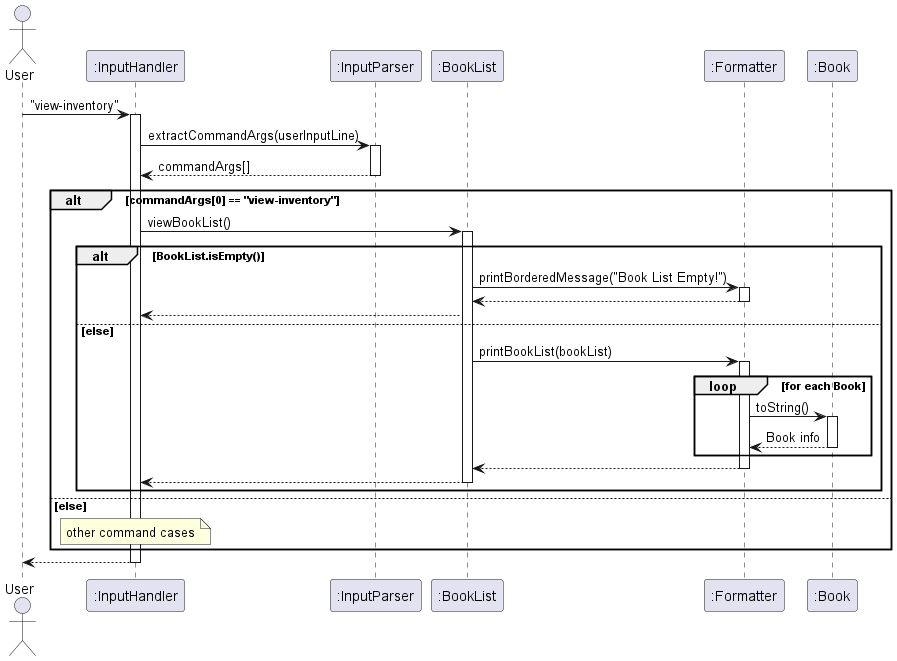

1. User issues command:
   The user inputs the command in the CLI with the required arguments, e.g., `view-inventory`.

2. Command arguments are extracted:
   `InputHandler` first calls `InputParser.extractCommandArgs(...)` to extract the command to execute from the user input.

   - For example, the input `view-inventory` is split into:
     - `commandArgs[0]`: `"view-inventory"`

3. Command is executed:
   `InputHandler` invokes `BookList.viewBookList()` to list the existing books.

4. Check for empty inventory:
   `BookList` calls `BookList.isEmpty()` to check if there are existing books in the inventory.

   - If no book is found, `BookList` uses `Formatter` to print a "Book List Empty!" message and exits early.
   - If there are books found, the flow continues.

5. Inventory is printed:
   `BookList` calls `Formatter.printBookList(bookList)` to format and print the books in the inventory. `Formatter` will then start by printing "Here are the books in your inventory:" to indicate the start of the printing. For each book, `Formatter` will then:
   1. Increment a `count` to number the books
   2. Invoke `Book.toString()` to convert all the book's information to a string
   3. Print the concatenated `count` and book information.

### Viewing Loans

The `view-loans` feature allows the user to view all existing loans in the inventory. All loan information will be printed out in a numbered list. The program will first check if the loan list is empty before proceeding to print out the list.

`InputHandler` coordinates with `InputParser`, `Loan`, `LoanList` and `Formatter` classes to implement the feature.

The following UML sequence diagram shows how the `view-loans` command is handled.

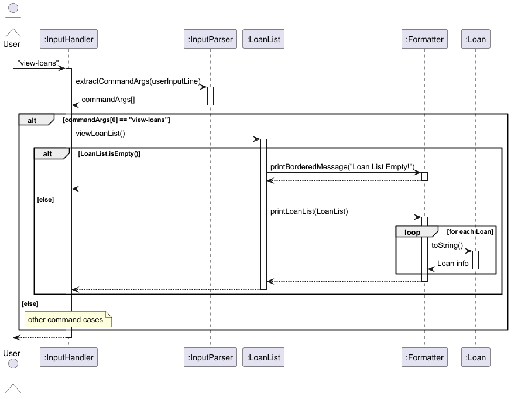

1. User issues command:
   The user inputs the command in the CLI with the required arguments, e.g., `view-loans`.

2. Command arguments are extracted:
   `InputHandler` first calls `InputParser.extractCommandArgs(...)` to extract the command to execute from the user input.

   - For example, the input `view-loans` is split into:
     - `commandArgs[0]`: `"view-loans"`

3. Command is executed:
   `InputHandler` invokes `LoanList.viewLoanList()` to list the existing loans.

4. Check for empty loan list:
   `LoanList` calls `LoanList.isEmpty()` to check if there are existing loans in the loan list.

   - If no loans are found, `LoanList` uses `Formatter` to print a "Loan List Empty!" message and exits early.
   - If there are any loans found, the flow continues.

5. Loan list is printed:
   `LoanList` calls `Formatter.printLoanList(loanList)` to format and print the loans. `Formatter` will then start by printing "Here are the active loans:" to indicate the start of the printing. For each loan, `Formatter` will then:
   1. Increment a `count` to number the books
   2. Invoke `Loan.toString()` to convert all the book's information to a string
   3. Print the concatenated `count` and book information.

### Updating Books

The `update-book` feature allows the user to add update existing book details. The system ensures that a book of the same title exists in the inventory and before performing the update. Note that the book title cannot be updated.

`InputHandler` coordinates with `InputParser`, `BookList`, `Formatter`, and `Storage` classes to implement the feature.

The following UML sequence diagram shows how the `update-book update-book BOOK_TITLE a/AUTHOR cat/CATEGORY cond/CONDITION loc/LOCATION [note/NOTE]` command is handled.

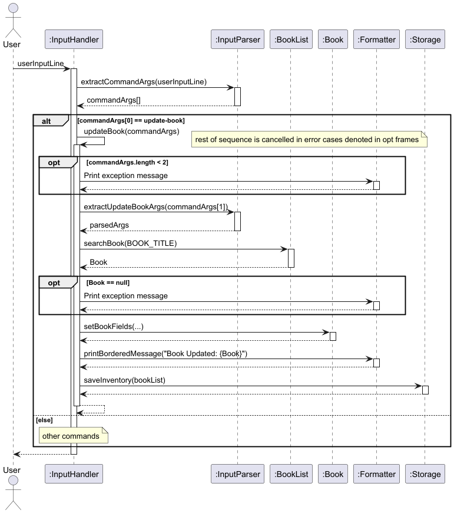

1. User issues command:
   The user inputs the command in the CLI with the required arguments, e.g., `update-book The Great Gatsby a/F. Scott Fitzgerald cat/Fiction cond/POOR loc/Shelf B3 note/Replace ASAP`.

2. Command arguments are extracted:
   `InputHandler` first calls `InputParser.extractCommandArgs(...)` to split the user input into command arguments.

   - For example, the input `update-book The Great Gatsby a/F. Scott Fitzgerald cat/Fiction cond/POOR loc/Shelf B3 note/Replace ASAP` is split into:
     - `commandArgs[0]`: `"update-book"`
     - `commandArgs[1]`: `"The Great Gatsby a/F. Scott Fitzgerald cat/Fiction cond/POOR loc/Shelf B3 note/Replace ASAP"`

3. Book arguments are parsed:
   `InputHandler` invokes `InputParser.extractUpdateBookArgs(...)` to parse the second part of the command (`commandArgs[1]`) into the following components:

   - Book title
   - Author
   - Category
   - Condition
   - Location
   - Note (Optional)

4. Book is validated:
   `InputHandler` calls `BookList.findBookByTitle(bookTitle)` to check if the book exists in the inventory.

   - If the book is not found, `InputHandler` uses `Formatter` to print a exception message and exits early.
   - If the book is found, the flow continues.

5. Book is updated:
   `InputHandler` updates the book details by invoking the following methods from `Book` class:

   - `Book.setAuthor(newAuthor)`
   - `Book.setCategory(newCategory)`
   - `Book.setCondition(newCondition)`
   - `Book.setLocation(newLocation)`
   - `Book.setNote(newNote)` (only if note is provided)

6. Changes are saved to persistent storage:
   `InputHandler` calls `Storage.saveLoans(...)` and `Storage.saveInventory(...)` to save the updated book details.

7. Success message is displayed:
   `InputHandler` uses `Formatter` to print a message indicating that the book was successfully updated.

### Updating Loans

The `edit-loan` feature allows the user to add update existing loan details. The system ensures that a book of the same title and a corresponding loan exists before performing the update. Note that the book title and the borrower name cannot be updated.

`InputHandler` coordinates with `InputParser`, `BookList`, `LoanList`, `Loan`, `Formatter`, and `Storage` classes to implement the feature.

The following UML sequence diagram shows how the `edit-loan INDEX [n/BORROWER_NAME] [d/RETURN_DATE] [p/PHONE_NUMBER] [e/EMAIL]` command is handled.

- The RETURN_DATE must be in the format **DD-MM-YYYY** when provided as input.
- The RETURN_DATE cannot be in the past.
- The PHONE_NUMBER can only be in numeric strings

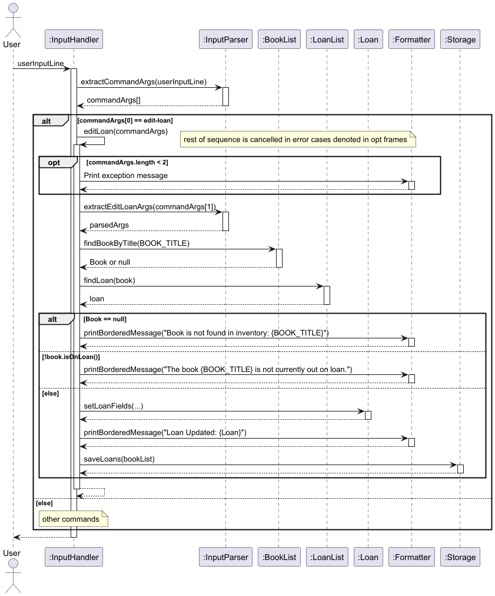

1. User issues command:
   The user inputs the command in the CLI with the required arguments, e.g.,
   `edit-loan 1 n/Mary d/29-06-2025 p/91234567 e/123abc@gmail.com`.

2. Command arguments are extracted:
   `InputHandler` first calls `InputParser.extractCommandArgs(...)` to split the user input into command arguments.

   - For example, the input `edit-loan 1 n/Mary d/29-06-2025 p/91234567 e/123abc@gmail.com` is split into:
     - `commandArgs[0]`: `"edit-loan"`
     - `commandArgs[1]`: `"1 n/Mary d/29-06-2025 p/91234567 e/123abc@gmail.com"`

3. Loan arguments are parsed:
   `InputHandler` invokes `InputParser.extractEditLoanArgs(...)` to parse the second part of the command (`commandArgs[1]`) into the following components:

   - Index
   - Borrower Name
   - Return Date
   - Phone Number
   - Email

4. Loan is validated:
   `InputHandler` calls `LoanList.findLoanByIndex(index)`and `BookList.findBookByTitle(bookTitle)` to check if the book and loan exists correspondingly.

   - If the book is not found, `InputHandler` uses `Formatter` to print a exception message and exits early.
   - If the Loan is not found, `InputHandler` uses `Formatter` to print a message and exits early.
   - If the book and loan is found, the flow continues.

5. Loan is updated:
   `InputHandler` updates the loan details if needed by invoking the following methods from `Loan` class:

   - `loan.setBorrowerName(borrowerName)`
   - `loan.setReturnDate(returnDate)`
   - `loan.setPhoneNumber(phoneNumber)`
   - `loan.setEmail(email)`

6. Changes are saved to persistent storage:
   `InputHandler` calls `Storage.saveLoans(...)` and `Storage.saveInventory(...)` to save the updated loan details.

7. Success message is displayed:
   `InputHandler` uses `Formatter` to print a message indicating that the loan was successfully updated.

### Add Note

The `add-note` feature allows the user to add note to a book in the inventory. The system ensures that the book has no note before it can be updated

`InputHandler` coordinates with `InputParser`, `BookList`, `Book`, `Formatter`, and `Storage` classes to implement the feature.

The following UML sequence diagram shows how the `add-note BOOK_TITLE note/NOTE` command is handled.

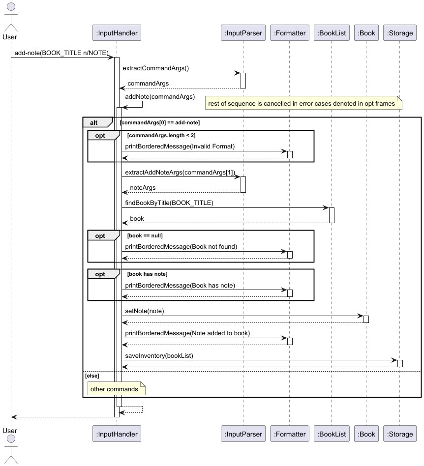

1. User issues command:
   The user inputs the command in the CLI with the required arguments, e.g., `add-note The Great Gatsby note/Amazing Book`.

2. Command arguments are extracted:
   `InputHandler` first calls `InputParser.extractCommandArgs(...)` to split the user input into command arguments.

   - For example, the input `add-note The Great Gatsby note/Amazing Book` is split into:
     - `commandArgs[0]`: `add-note`
     - `commandArgs[1]`: `The Great Gatsby note/Amazing Book`

3. Book arguments are parsed:
   `InputHandler` invokes `InputParser.extractAddNoteArgs(...)` to parse the second part of the command (`commandArgs[1]`) into the following components:

   - Book title
   - Note

4. Note is validated:
   - If the book have a note attached, `InputHandler` uses `Formatter` to print a ""Book already has a note: current note" message and exits early.
   - If the book is found without a note, the flow continues.

5. Note created:
   - The new note is added to the book

6. Changes are saved to persistent storage:
   `InputHandler` calls `Storage.saveLoans(...)` and `Storage.saveInventory(...)` to save the updated book list and inventory.

7. Success message is displayed:
   `InputHandler` uses `Formatter` to print a message indicating that the note was successfully added.

### Delete Note

The `delete-note` feature allows the user to delete a note that is attached to a book in the inventory. The system ensures that the book has a note before it can be updated

`InputHandler` coordinates with `InputParser`, `BookList`, `Book`, `Formatter`, and `Storage` classes to implement the feature.

The following UML sequence diagram shows how the `delete-note BOOK_TITLE` command is handled.

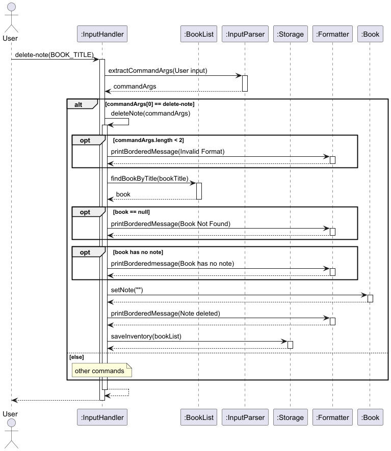

1. User issues command:
   The user inputs the command in the CLI with the required arguments, e.g., `delete-note The Great Gatsby`.

2. Command arguments are extracted:
   `InputHandler` first calls `InputParser.extractCommandArgs(...)` to split the user input into command arguments.

   - For example, the input `delete-note The Great Gatsby` is split into:
     - `commandArgs[0]`: `update-note`
     - `commandArgs[1]`: `The Great Gatsby`

3. Note is validated:
   - If the book does not have a note attached, `InputHandler` uses `Formatter` to print a "No note exists for the book: Book_Title" message and exits early.
   - If the book is found with a note, the flow continues.

4. Note deleted:
   - The note is deleted from the book

5. Changes are saved to persistent storage:
   `InputHandler` calls `Storage.saveLoans(...)` and `Storage.saveInventory(...)` to save the updated book list and inventory.

6. Success message is displayed:
   `InputHandler` uses `Formatter` to print a message indicating that the note was successfully deleted

### Update Note

The `update-note` feature allows the user to update a note that is attached to a book in the inventory. The system ensures that the book has note before it can be updated

`InputHandler` coordinates with `InputParser`, `BookList`, `Book`, `Formatter`, and `Storage` classes to implement the feature.

The following UML sequence diagram shows how the `update-note BOOK_TITLE note/NOTE` command is handled.

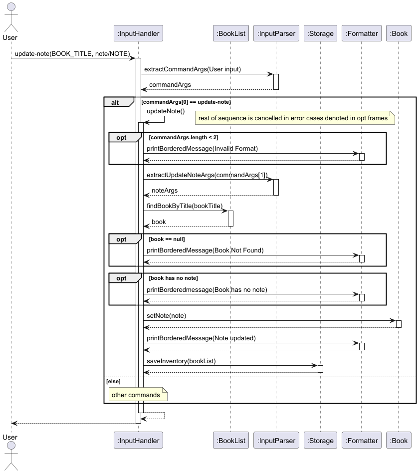

1. User issues command:
   The user inputs the command in the CLI with the required arguments, e.g., `update-note The Great Gasby note/Amazing Book`.

2. Command arguments are extracted:
   `InputHandler` first calls `InputParser.extractCommandArgs(...)` to split the user input into command arguments.

   - For example, the input `update-note The Great Gasby note/Amazing Book` is split into:
     - `commandArgs[0]`: `update-note`
     - `commandArgs[1]`: `The Great Gasby note/Amazing Book`

3. Book arguments are parsed:
   `InputHandler` invokes `InputParser.extractUpdateNoteArgs(...)` to parse the second part of the command (`commandArgs[1]`) into the following components:

   - Book title
   - Note

4. Note is validated:
   - If the book does not have a note attached, `InputHandler` uses `Formatter` to print a "Book does not have a note. Please use add-note instead." message and exits early.
   - If the book is found with a note, the flow continues.

5. Note created:
   - The new note is used to replace the old note that was attached to the book

6. Changes are saved to persistent storage:
   `InputHandler` calls `Storage.saveLoans(...)` and `Storage.saveInventory(...)` to save the updated book list and inventory.

7. Success message is displayed:
   `InputHandler` uses `Formatter` to print a message indicating that the note was successfully updated

### Update Note

The `update-note` feature allows the user to update a note that is attached to a book in the inventory. The system ensures that the book has note before it can be updated

`InputHandler` coordinates with `InputParser`, `BookList`, `Book`, `Formatter`, and `Storage` classes to implement the feature.

The following UML sequence diagram shows how the `update-note BOOK_TITLE note/NOTE` command is handled.


1. User issues command:
   The user inputs the command in the CLI with the required arguments, e.g., `update-note The Great Gasby note/Amazing Book`.

2. Command arguments are extracted:
   `InputHandler` first calls `InputParser.extractCommandArgs(...)` to split the user input into command arguments.

   - For example, the input `update-note The Great Gasby note/Amazing Book` is split into:
     - `commandArgs[0]`: `update-note`
     - `commandArgs[1]`: `The Great Gasby note/Amazing Book`

3. Book arguments are parsed:
   `InputHandler` invokes `InputParser.extractUpdateNoteArgs(...)` to parse the second part of the command (`commandArgs[1]`) into the following components:

   - Book title
   - Note

4. Note is validated:
   - If the book does not have a note attached, `InputHandler` uses `Formatter` to print a "Book does not have a note. Please use add-note instead." message and exits early.
   - If the book is found with a note, the flow continues.

5. Note created:
   - The new note is used to replace the old note that was attached to the book

6. Changes are saved to persistent storage:
   `InputHandler` calls `Storage.saveLoans(...)` and `Storage.saveInventory(...)` to save the updated book list and inventory.

7. Success message is displayed:
   `InputHandler` uses `Formatter` to print a message indicating that the note was successfully updated

### Save Inventory

The save inventory feature automatically saves the inventory each time the user makes a change.
If no existing persistent storage file is detected, it will be created in the default location `./data/bookKeeper_bookList.txt`. The file path can also be customized using the `setInventoryFilePath()` method.

The method `saveInventory(bookList)` is invoked by `InputHandler` after any method call that makes changes to the current inventory.

The following UML sequence diagram shows the relevant behaviour:

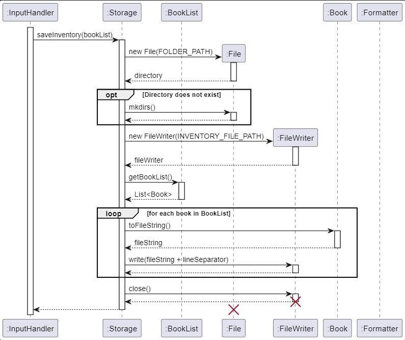

1. Initiation: `InputHandler` invokes `Storage.saveInventory(bookList)`.
2. Directory Check: A `File` object is created for the directory. If the directory does not exist, it is created using `mkdirs()`.
3. FileWriter Creation: A new `FileWriter` is created for the file at the path specified by `inventoryFilePath`.
4. Retrieving Book List: `getBookList()` is called on the `BookList` instance passed into `saveInventory(bookList)` to obtain the list of `Book` objects.
5. Writing Each Book: For each `Book` in the list, `toFileString()` is called to get a string representation. This string is then written to the file via `FileWriter`.
6. Closing: After writing all books, `FileWriter` is closed to complete the writing process.

Error Handling: If an `IOException` occurs during any file operations, an error message is displayed via `Formatter.printBorderedMessage()`.

### Load Inventory

The load inventory feature loads the inventory from the existing persistent data storage file if it exists. If it does not exist, an empty inventory is used. The file path defaults to `./data/bookKeeper_bookList.txt` but can be customized using the `setInventoryFilePath()` method.

The method `loadInventory()` is called once by `InputHandler` at the start of the program.

The following UML sequence diagram shows the relevant behaviour:

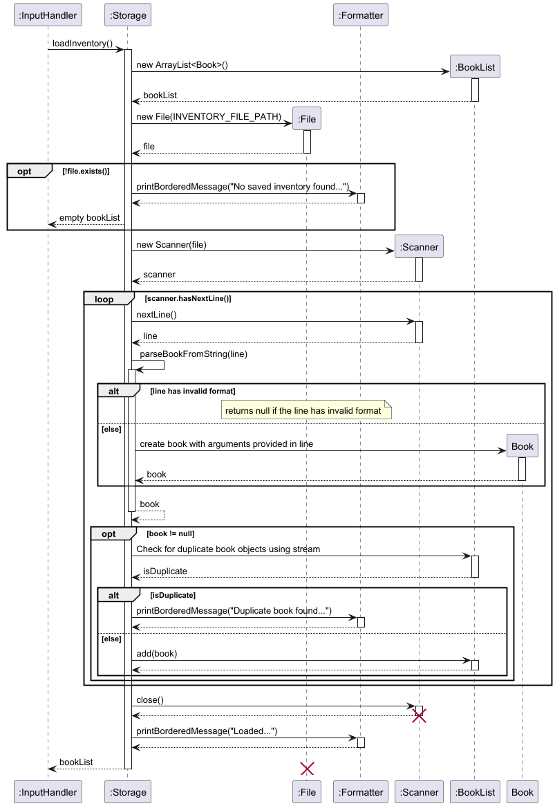

1. Initialization: `InputHandler` invokes `Storage.loadInventory()`, which initializes an empty `ArrayList<Book>`.

2. File Existence Check:  
   A `File` object is created for the inventory file path.  
   - If the file does not exist:
     - A message is printed using `Formatter.printBorderedMessage()` indicating no saved inventory was found.
     - A new file is created, and an empty `ArrayList<Book>` is returned.

3. File Reading:  
   If the file exists:
   - A `Scanner` reads the file line by line.
   - Each line is passed to `parseBookFromString(line)` to convert it into a `Book` object.

4. Book Validation:  
   - If the `Book` is `null`, a message is printed indicating the entry was skipped.
   - If valid, duplicates are checked using `bookList.stream().anyMatch(...)`.  
     - If a duplicate is found, a message is printed, and the book is skipped.
     - Otherwise, the book is added to the `bookList`.

5. Completion:  
   - After processing all lines in file, the `Scanner` is closed.
   - A message is printed indicating the number of books loaded.
   - The populated `bookList` is returned.


## Appendix A: Product scope

### Target user profile

#### Primary Users:

Small-scale library managers, community librarians, school library staff, or volunteers who need a lightweight,
no-frills way to track books and loans.

#### User Background:

- Has basic computer literacy
- Comfortable using the command line
- Prefers typing and desktop apps

### Value proposition

BookKeeper is a lightweight, command-line library manager designed for simplicity and speed.
It empowers small libraries to efficiently track book inventories and manage loans without the need for bulky software or cloud subscriptions.
BookKeeper gives you full control over your collection in a clean, offline-friendly CLI format that’s easy to set up and use.

## Appendix B: User Stories

| Version | As a...       | I want to...                                                           | So that I can                                                       |
| ------- | ------------- | ---------------------------------------------------------------------- | ------------------------------------------------------------------- |
| `v1.0`  | Librarian     | View inventory, including book count                                   | See my existing books                                               |
| `v1.0`  | Librarian     | Add new books to the system easily                                     | Update my inventory when acquiring new books                        |
| `v1.0`  | Librarian     | Remove books when lost or permanently borrowed                         | Maintain an accurate inventory                                      |
| `v1.0`  | Librarian     | Add book loans, including borrower details and return dates            | Ensure books are returned on time and inform others of availability |
| `v1.0`  | Librarian     | Delete book loans, including borrower details and return dates         | Maintain accurate loan records                                      |
| `v1.0`  | Librarian     | View on-going loans                                                    | Keep track of what books are loaned out                             |
| `v2.0`  | Librarian     | Categorize my inventory                                                | Make searching for books more convenient                            |
| `v2.0`  | Librarian     | Manage/Update book availability, including borrowed and reserved books | Efficiently allocate books                                          |
| `v2.0`  | Librarian     | Track book conditions (e.g good, fair, poor)                | Maintain detailed records                                           |
| `v2.0`  | Librarian     | Add personal notes about individual books                              | Maintain detailed records                                           |
| `v2.0`  | Librarian     | Edit existing book loans' due dates                                    | Better track by updating book loans                                 |
| `v2.0`  | Librarian     | Add contact details for borrowers                                      | Easily reach out to borrowers when needed                           |
| `v2.0`  | Librarian     | Keep track of where available books are in the library                 | Help visitors find books                                            |
| `v2.0`  | New Librarian | View a list of available commands                                      | Learn how to use the application                                    |

## Appendix C: Non-Functional Requirements

1. Technical Requirements: Any _mainstream OS_ with Java 17 installed.
2. Project Scope Constraints: Data storage is only to be performed locally.

## Appendix D: Glossary

- _Mainstream OS_ - Windows, Linux, Unix, MacOS

## Appendix E: Instructions for manual testing

### Manual Testing

View the [User Guide](UserGuide.md) for the full list of UI commands and their related use case and expected outcomes.

### JUnit Testing

JUnit tests are written in the subdirectory `test` and serve to test key methods part of the application.
