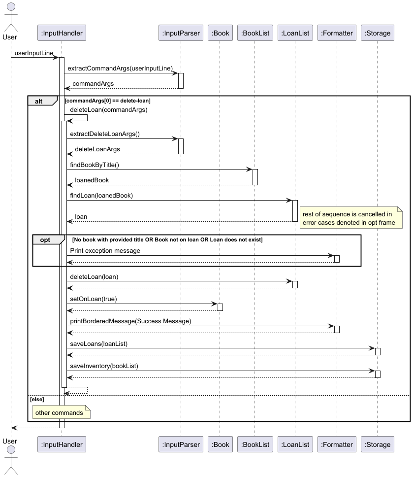

# Developer Guide

## Acknowledgements

{list here sources of all reused/adapted ideas, code, documentation, and third-party libraries -- include links to the
original source as well}

## Setting up, getting started

## Design

{From course website:
you may omit the Architecture section (no penalty)
if you have not organized the code into clearly divided components (no penalty if you didn't), you can use a single
class diagram (if it is not too complicated) or use several class diagrams each describing a different area of the
system.}

### Implementation

{TODO BY 02/04/2025: Each member should describe the implementation of at least one enhancement they have added (or
planning to add).}

#### Adding Books/Loans

#### Removing Books

The `remove-book` feature allows the user to remove a book from the inventory using the book title as the identifier.
The system will first check if the book exists, remove all associated loans (if any) before finally removing the book
from the inventory.
This prevents orphaned loan records from remaining in the system.

`InputHandler` coordinates with `BookList`, `LoanList` and `Formatter` classes to implement the feature.

The following UML sequence diagram shows how the `remove-book TITLE` command is handled.

1. User issues command
   The user inputs the command in the CLI with the book title as an argument, e.g. `remove-book The Hobbit`

2. `InputHandler` first extracts command arguments by invoking `extractCommandArgs(...)`.
   Then, `removeBook(commandArgs)` is invoked to handle the command.

3. `BookList` is queried for the book
   `InputHandler` calls `BookList.findBookByTitle(bookTitle)` to search for the book.
    - If the book is not found `(toRemove == null)`, `InputHandler` uses `Formatter` to print a "Book not found" message
      and exits early.
    - If the book is found, the flow continues.

4. Associated loans are removed
   `LoanList.removeLoansByBook(toRemove)` is called to remove all loans associated with the book. This ensures no
   orphaned loans are left behind.

5. Book is removed from the system
   `InputHandler` calls `BookList.removeBook(toRemove)` to remove the book.

6. Success message is displayed
   `Formatter` is used to print a message indicating successful removal.

#### Delete Loans
The `delete-loans` feature allows the user to remove a loan from the list of loans that is being tracked by using the book title and the borrower name as identifiers.
The program will check if first the book exists, then it will use the book object and the borrower name to search if the loan exist before proceeding to remove it. 

The following UML sequence diagram shows the behaviour of delete-loans TITLE n/BORROWER_NAME

1. User issues command
   The user inputs the command with book title and borrower name as arguments e.g `delete-loan The Hobbit n/Mary`.

2. `InputHandler` extract command arguments with `extractCommandArgs(...)` followed by deleteLoan(commandArgs).

3. `InputHandler` calls `BookList.findBookByTitle(bookTitle)` to search for the book.
   `InputHandler` calls `LoanList.findLoans(bookTitle, borowerName)` to search for the loan.
    - If the book is not found `(loanedBook == null)`, book is not on loan, or there is not existing loan `InputHandler` uses `Formatter` to print a error message and stops the command early.
    - If the book is found, the flow continues.

4. Delete corresponding loan
   `InputHandler` calls `LoanList.deleteLoans(loan)` to delete the loan.

5. Sets book to not on loan
   `InputHandler` calls loanedBook.setOnLoan(false).

6. Success message is displayed
   `Formatter` is used to print a message indicating successful removal.
   
#### Viewing Books/Loans

#### Updating Books/Loans

## Appendix A: Product scope

### Target user profile

#### Primary Users:

Small-scale library managers, community librarians, school library staff, or volunteers who need a lightweight,
no-frills way to track books and loans.

#### User Background:

- Has basic computer literacy
- Comfortable using the command line
- Prefers typing and desktop apps

### Value proposition
BookKeeper is a lightweight, command-line library manager designed for simplicity and speed. 
It empowers small libraries to efficiently track book inventories and manage loans without the need for bulky software or cloud subscriptions.
BookKeeper gives you full control over your collection in a clean, offline-friendly CLI format that’s easy to set up and use.

## Appendix B: User Stories

Priorities: High (must have) - `***`, Medium (nice to have) - `**`, Low (unlikely to have) - `*`

| Priority | As a...       | I want to...                                                           | So that I can                                                       |
|----------|---------------|------------------------------------------------------------------------|---------------------------------------------------------------------|
| `***`    | Librarian     | View inventory, including book count                                   | See my existing books                                               |
| `***`    | Librarian     | Add new books to the system easily                                     | Update my inventory when acquiring new books                        |
| `***`    | Librarian     | Remove books when lost or permanently borrowed                         | Maintain an accurate inventory                                      |
| `***`    | Librarian     | Add book loans, including borrower details and return dates            | Ensure books are returned on time and inform others of availability |
| `***`    | Librarian     | Delete book loans, including borrower details and return dates         | Maintain accurate loan records                                      |
| `***`    | Librarian     | View on-going loans                                                    | Keep track of what books are loaned out                             |
| `**`     | Librarian     | Categorize my inventory                                                | Make searching for books more convenient                            |
| `**`     | Librarian     | Manage/Update book availability, including borrowed and reserved books | Efficiently allocate books                                          |
| `**`     | Librarian     | Track book conditions (e.g., damages, special editions)                | Maintain detailed records                                           |
| `**`     | Librarian     | Add personal notes about individual books                              | Maintain detailed records                                           |
| `**`     | Librarian     | Edit existing book loans' due dates                                    | Better track by updating book loans                                 |
| `**`     | Librarian     | Add contact details for borrowers                                      | Easily reach out to borrowers when needed                           |
| `**`     | Librarian     | Keep track of where available books are in the library                 | Help visitors find books                                            |
| `**`     | New Librarian | View a list of available commands                                      | Learn how to use the application                                    |

## Appendix C: Non-Functional Requirements

{Give non-functional requirements}

## Appendix D: Glossary

* *glossary item* - Definition

## Appendix E: Instructions for manual testing

{Give instructions on how to do a manual product testing e.g., how to load sample data to be used for testing}
